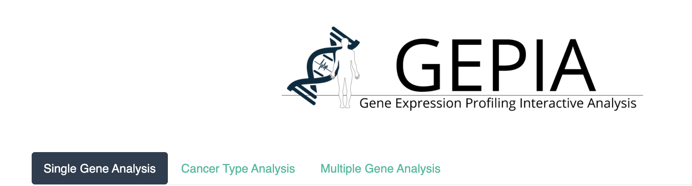
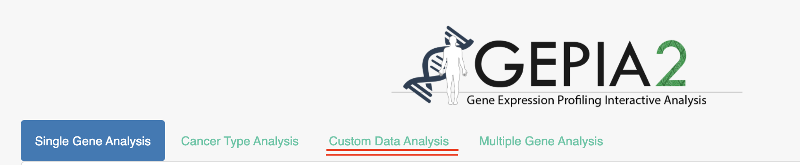
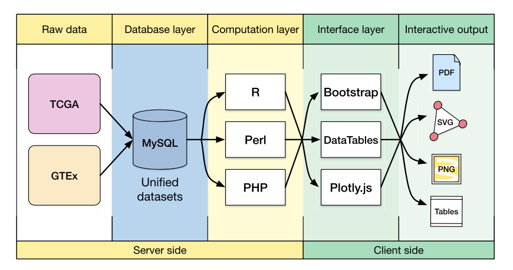
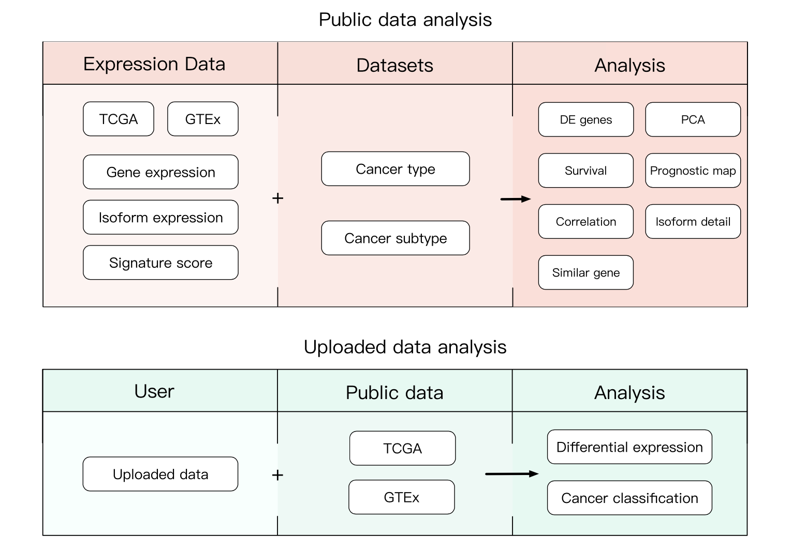

# GEPIA: Gene Expression Profiling Interactive Analysis

[Xiaoni](xiaoni0601@gmail.com) Bioinformatics Database 09082020

- [GEPIA2](http://gepia2.cancer-pku.cn/#index), A updated version of [GEPIA](http://gepia.cancer-pku.cn/index.html).
  - It is built by the HTML5 and JavaScript libraries, including jQuery, Bootstrap for the client-side user interface.
  - The server-side and interactive data processing are carried out by PHP scripts (version 7.0.13).
  - download and re-computed TCGA and GTEx gene expression data from raw RNA-Seq data by the UCSC Xena project based on a uniform pipeline.

***

***

**Schema** describing the features of public data and uploaded data analyses in **GEPIA**.
***

**Schema** describing the features of public data and uploaded data analyses in **GEPIA2**.
